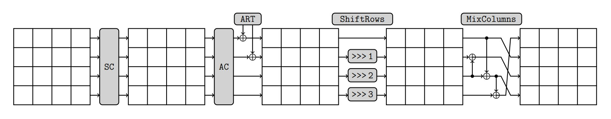

# Construction

Number of rounds for SKINNY-n-t, with n-bit internal state and t-bit tweakey state.

<table>
    <thead>
        <tr>
            <th></th>
            <th colspan=3>Tweakey Size t</th>
        </tr>
		<tr>
            <th>Block Size n</th>
            <th>n</th>
	        <th>2n</th>
	        <th>3n</th>
        </tr>
    </thead>
    <tbody>
        <tr>
            <td>64</td>
            <td>32</td>
            <td>36</td>
		    <td>40</td>
	    </tr>
	    <tr>
            <td>128</td>
            <td>40</td>
            <td>48</td>
		    <td>56</td>
	    </tr>
    </tbody>
</table>

The SKINNY round function applies five different transformations: SubCells (SC), AddConstants (AC), AddRoundTweakey (ART), ShiftRows (SR) and MixColumns (MC).

- [Tweakey Schedule](https://shashwatj07.github.io/skinny/construction/tweakeyschedule.html)
    - [Permutation](https://shashwatj07.github.io/skinny/construction/tweakeyschedule/permutation.html)
    - [LFSR](https://shashwatj07.github.io/skinny/construction/tweakeyschedule/lfsr.html)
- [SubCells (SC)](https://shashwatj07.github.io/skinny/construction/subcells.html)
- [AddConstants (AC)](https://shashwatj07.github.io/skinny/construction/addconstants.html)
- [AddRoundTweakey (ART)](https://shashwatj07.github.io/skinny/construction/addroundtweakey.html)
- [ShiftRows (SR)](https://shashwatj07.github.io/skinny/construction/shiftrows.html)
- [MixColumns (MC)](https://shashwatj07.github.io/skinny/construction/mixcolumns.html)
