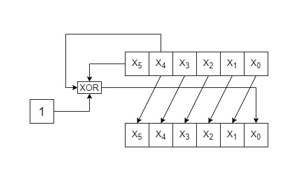
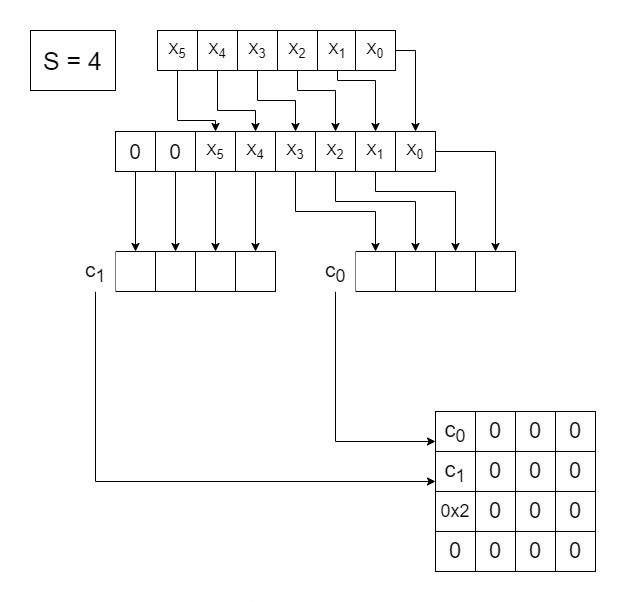
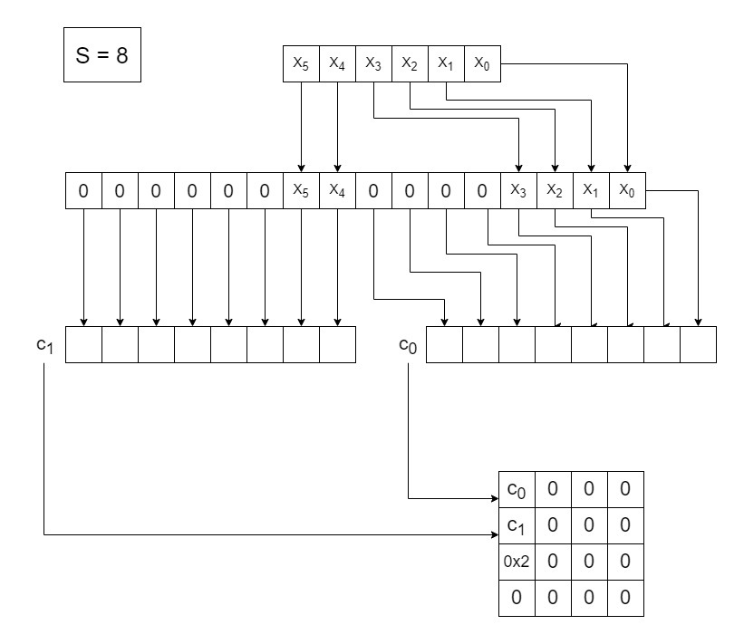
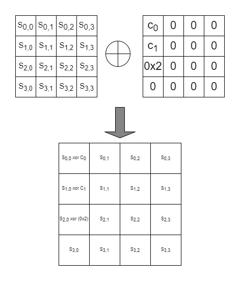

# AddConstants
A 6-bit affine LFSR, whose state is denoted (rc5, rc4, rc3, rc2, rc1, rc0)
(with rc0 being the least significant bit), is used to generate round constants. Its update
function is defined as 

The six bits are initialized 0 and are updated before use in a given round  
## Table for round constants for each round
 
| Rounds |Constants|
| :---:  |  :---:  |
| 1 -16 | 01,03,07,0F,1F,3E,3D,3B,37,2F,1E,3C,39,33,27,0E |
|17 - 32| 1D,3A,35,2B,16,2C,18,30,21,02,05,0B,17,2E,1C,38 |
|33 - 48| 31,23,06,0D,1B,36,2D,1A,34,29,12,24,08,11,22,04 |
|49 - 62|   09,13,26,0C,19,32,25,0A,15,2A,14,28,10,20     |

Then bits are arranged in a array of 4x4. depending on the size of bits in a cell of state matrix as shown in the below diagrams.
### For s = 4

### For s = 8

The round constants are combined with the state, respecting array positioning, using
bitwise exclusive-or

