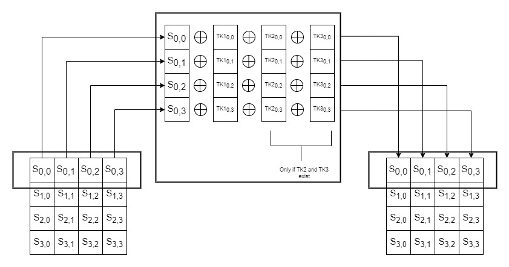

# AddRoundTweakey
The first and second rows of all tweakey arrays are extracted and
bitwise exclusive-ored to the cipher internal state, respecting the array positioning.  
### Flow chart for this operation

 
Do the same with the second row from the state matrix and tweakeys.
