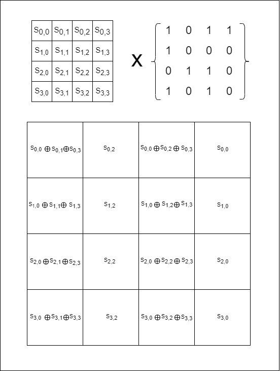

<<<<<<< HEAD
for this step we are multiplying the state matrix with a special matrix
=======
# MixColumns
For this step we are multiplying the state matrix with a special matrix
>>>>>>> 41614a74848abcbc3d2981942d9e1b3494d59cef

 | 1 | 0 | 1 | 1 |
 |---|---|---|---|
 | 1 | 0 | 0 | 0 |
 | 0 | 1 | 1 | 0 |
 | 1 | 0 | 1 | 0 |

<<<<<<< HEAD

=======

>>>>>>> 41614a74848abcbc3d2981942d9e1b3494d59cef
