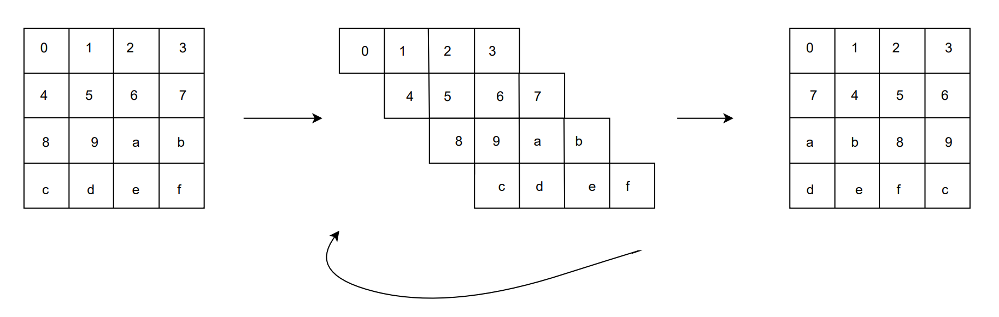

# ShiftRows
In this operation, the rows of the internal cipher state cell array are rotated to the right contrary to AES, in which it is rotated to left. To be more precise, the second cell row is rotated by 1 cell to the right, the third cell row is rotated by 2 cells to the right, and the fourth cell rows are rotated by 3 positions to the right. 

Given diagram showshow these rows are shifted. 

