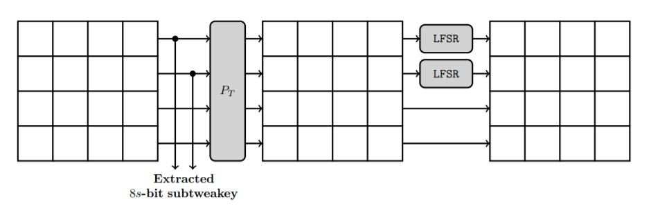

# Tweakey Schedule
* The tweakey arrays are updated as follows (the tweakey schedule is illustrated and end of this page). First, a permutation PT is applied on the cells positions of all tweakey
arrays

* Every cell of the first and second rows of TK2 and TK3 (for the SKINNY versions where TK2 and TK3 are used) are individually updated with an LFSR

## You can look at Permutation and LFSR in detail in below links
- [Permutation](https://shashwatj07.github.io/skinny/construction/tweakeyschedule/permutation.html)
- [LFSR](https://shashwatj07.github.io/skinny/construction/tweakeyschedule/lfsr.html)

#### Complete flow diagram for tweakey schedule

