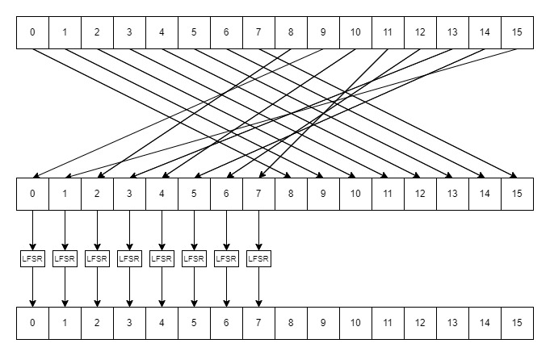

A permutation pt is applied to all the TKs

| 0 |  1 | 2 |  3 |  4 |  5 |  6 |  7 | 8 | 9 | 10 | 11 | 12 | 13 | 14 | 15 |
| - | -- | - | -- | -- | -- | -- | -- | - | - | -- | -- | -- | -- | -- | -- |
| 9 | 15 | 8 | 13 | 10 | 14 | 12 | 11 | 0 | 1 | 2  | 3  | 4  | 5  | 6  | 7  |

This corresponds
to the following reordering of the matrix cells, where indices are taken row-wise:
(0, . . . , 15) −→ (9, 15, 8, 13, 10, 14, 12, 11, 0, 1, 2, 3, 4, 5, 6, 7)

## For TK1

and for T2 and T3 a LFSR is also applied at last.
## For TK2 and TK#

