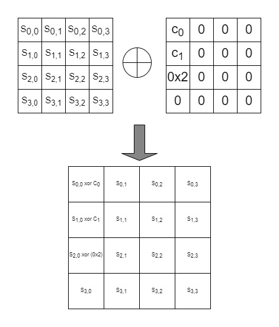

# Security against slide attacks

slide attack we all know is about finding a pair of plaintexts where one of them also occur in between the conversion of first plaintext to the cipher  

Add constant is the step which prevents the from occuring in skinny cipher and the traditional slide attack cant be applied.

so, the little bit of chances for which the slide attack can be effective will be due to the AFFINE LFSR used in  the transformation of round constants. 

Differential characterstics of the cipher can be affected by the different in the round constant which may be important and helpful for the attacker.

So, after exhaustively calculating the difference between every round possible of having sliding number, we used mixed integer linear programming to get the lower bounds of the number of active sboxes for all these constant differences. 

If we allow to start the attacker from any round ,then for this type of attack we found 36 active sboxes for 11 rounds and 41 sboxes for 12 rounds(these values are for lower bounds). 

these bounds don't surely influence the differential characteristics,afterall in this case we are giving a upper hand to attacker to start from any round which is not going to be in the real case scenario make the skinny cipher invulnerable to slide attack. 

also the developers are researching more on this type of attack and till now it is safe from slide attack.

#### table for showing the lower bounds of the differences we found
 

